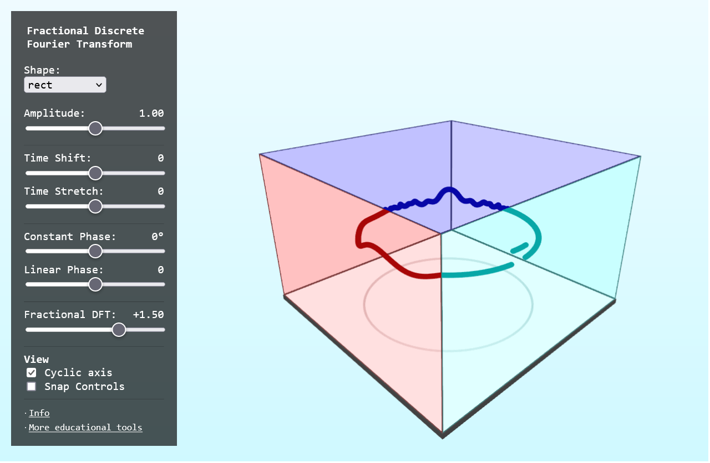

# FFT WASM

Discrete Fourier Transform in Svelte+ThreeJS+Rust+WASM



## Build WASM module

```sh
wasm-pack build
```

## Run Webserver

```sh
yarn --cwd www run dev
```

## Build Webapp

```sh
yarn --cwd www run build
```

Output will be in `www/build`